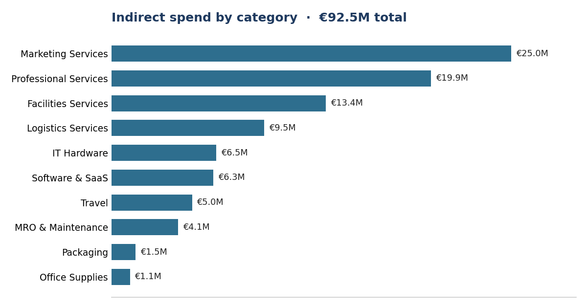
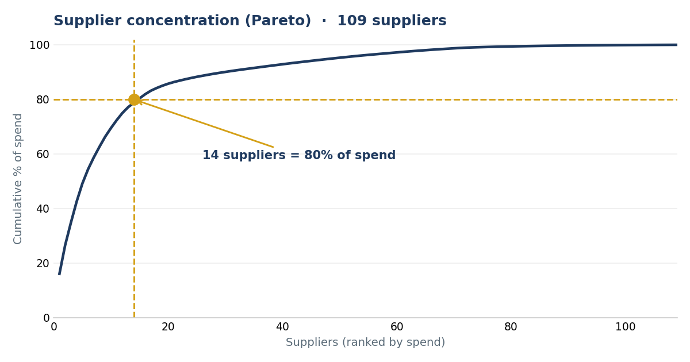
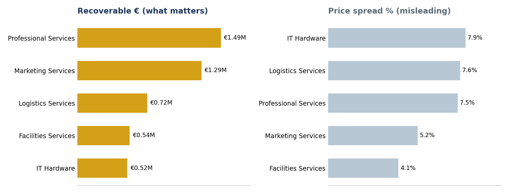
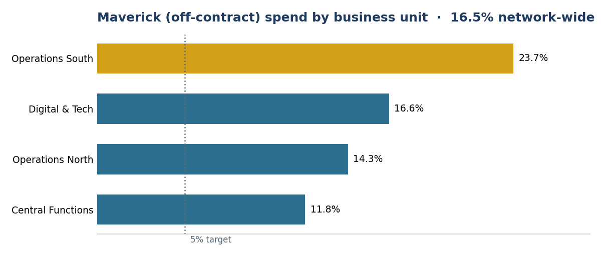

# Indirect Procurement Spend Analytics & Consulting Case Study

**€92.5M of indirect spend, read as a sourcing agenda.** Supplier concentration, price variance, maverick spend and tail consolidation — analysed in SQL, then turned into a consulting diagnosis, a savings bridge, and a 90-day roadmap.

> **Context.** I've worked in procurement and strategic sourcing for 7+ years (RFP management, supplier negotiation, enterprise accounts). I built this project to do in SQL and Excel what I've long done with procurement tools and judgment: turn raw purchase-order data into sourcing decisions — and then make the recommendation a client could act on.
>
> All data is **synthetic**, generated by [`generate_data.py`](generate_data.py) with realistic procurement patterns baked in. No employer or client data is used. Savings figures are **modelled, not realised results**. Companion project: [last-mile delivery analytics](https://github.com/ShrutiSMorab/lastmile-delivery-sql-analytics).

<br>

| | |
|---|---|
| **Spend analysed** | €92.5M indirect · 109 suppliers · 118 items · 10 categories · 4 business units · 24 months |
| **Ceiling identified** | ~€4.0M/yr theoretical |
| **Recommended** | **€1.3–1.9M/yr** realistic, after capture-rate haircuts |
| **Delivered** | Consulting report · 11-slide executive deck · 90-day roadmap · Excel dashboard |
| **Stack** | SQL (SQLite) · window functions · CTEs · Python · Excel |

### 📄 [**Read the full case study →**](CASE-STUDY.md)  ·  📊 [**View the deck →**](Indirect-Spend-Optimisation-Deck.pdf)  ·  🔍 [**Study guide: every query explained →**](STUDY-GUIDE.md)

---

## 1. Business questions

A fast-growing logistics-tech scale-up buys ~€46M/year of indirect goods and services across 10 categories and 4 business units. Ahead of a funding round, leadership asks:

1. **Where does the money go?** (spend cube: category × business unit × month)
2. **How concentrated is our supplier base** — and is that risk or leverage?
3. **Are we paying different prices for the same items?** What's that worth?
4. **How much spend bypasses our contracts** (maverick spend), and what does it cost?
5. **Where can we consolidate the supplier tail?**
6. **What should we do first** — over the next 90 days?

## 2. Data model

SQLite, 6 tables, line-item grain: 13,199 PO lines / 4,400 purchase orders, 109 suppliers, 118 catalogue items, 10 categories, 24 months (Jul 2024–Jun 2026).

```
business_units ──< po_lines >── suppliers ──< contracts
                     │    │
                  items  categories
```

The `contracts` table is what makes maverick-spend analysis possible: spend in a contracted category placed with a non-contracted supplier is off-contract. Everything runs off one calculation: **`spend = quantity × unit_price`**.

## 3. Analysis

| File | Question | SQL concepts |
|---|---|---|
| [`01_data_quality_checks.sql`](01_data_quality_checks.sql) | Can we trust the data? | LEFT JOIN + IS NULL, consistency checks |
| [`02_spend_overview.sql`](02_spend_overview.sql) | Spend cube | window % of total, month bucketing |
| [`03_supplier_concentration.sql`](03_supplier_concentration.sql) | Pareto / ABC | cumulative SUM() OVER, classification |
| [`04_price_variance.sql`](04_price_variance.sql) | Same item, different price | MIN/MAX spreads, savings simulation |
| [`05_maverick_spend.sql`](05_maverick_spend.sql) | Off-contract buying | LEFT JOIN as business signal |
| [`06_tail_spend.sql`](06_tail_spend.sql) | Supplier tail | threshold bucketing, opportunity sizing |

Full raw outputs: [`query_outputs.txt`](query_outputs.txt) · Raw data + field dictionary: [`spend-raw-data.xlsx`](spend-raw-data.xlsx)

## 4. Key findings

### Spend is top-heavy



€92.5M over 24 months. Marketing (27.0%), Professional Services (21.6%) and Facilities (14.5%) dominate — ~63% of the base in three categories. A clear October spike each year (~€5.0M vs ~€3.4M baseline) signals budget-flush behaviour worth governance attention.

### Concentration cuts both ways



Just **14 suppliers (12.8% of a 109-supplier base) carry 80% of spend** — strong negotiating leverage, but also concentration risk: the top supplier alone is **16.1%** of total spend. ABC: 14 A-suppliers (€72.9M), 34 B (€14.9M), 61 C-suppliers sharing just €4.8M.

### Price variance is the biggest prize — and a reframe



Repricing all volume at each item's best observed price frees **€5.68M (6.1% of spend)** in theory. IT Hardware shows the worst discipline *by percentage* — 33–37% spreads between best and worst price paid for identical items.

But IT Hardware is a small category. Weighted by absolute euros, **Professional Services (€1.49M) and Marketing (€1.29M) carry ~3× the recoverable value.**

> **Percentage spread tells you where discipline is worst. Absolute euros tell you where to start.**

This reframe reordered the sourcing agenda — it is the central judgment call of the study.

### Maverick spend is a process problem with a name



**16.5% of network spend is off-contract**, and it isn't evenly spread — **Operations South runs 23.7%** vs 11.8% at Central Functions. Off-contract purchases carry an **8.4% average price premium** for identical items ≈ **€1.2M of annualisable leakage**. The fix is process, not negotiation: catalogue coverage, approval workflows, BU-level compliance reporting.

### Tail consolidation is real but modest

MRO & Maintenance carries 16 sub-€100k suppliers (€534k of fragmented spend); Office Supplies 14. At a standard 5% consolidation-capture assumption the prize is **~€44k/yr** — worth doing, but sequenced after the price-variance and maverick fixes.

## 5. The savings bridge

Theoretical ceilings overstate what sourcing captures. Each lever is scoped to where the euros are, then haircut by a realistic capture rate. Annual run-rate (24-month totals halved).

| Lever | Identified /yr | Capture | **Realistic /yr** |
|---|---|---|---|
| Framework agreements + catalogue enforcement (top-5 categories) | €2.28M | 30–50% | **€0.7–1.1M** |
| Maverick-spend compliance programme (Operations South first) | €1.20M | 50–60% | **€0.6–0.7M** |
| Tail consolidation (MRO, Office Supplies, Packaging) | €0.09M | ~50% | **€0.04M** |
| **Total** | **≈ €4.0M ceiling** | | **€1.3–1.9M** |

**Why €1.3–1.9M and not €4.0M?** The ceiling assumes every line is repriced to its best-ever price and every off-contract euro is recovered. Neither happens. The capture rates are stated assumptions, adjustable once category owners validate scope — better than quoting a number I couldn't defend.

## 6. Recommended sourcing agenda

| # | Move | Realistic /yr |
|---|---|---|
| **1** | Framework agreements + catalogue enforcement — **Professional Services and Marketing first** (biggest €), then IT Hardware (worst spread) | €0.7–1.1M |
| **2** | Maverick-spend compliance programme — **Operations South first** | €0.6–0.7M |
| **3** | Tail consolidation — MRO, Office Supplies, Packaging | €0.04M |
| **⚠** | **De-risk the base** — dual-source the top 3 suppliers, build a contract-expiry pipeline | *risk, not savings* |

Full reasoning, 90-day roadmap and risk register: **[CASE-STUDY.md](CASE-STUDY.md)**.

## 7. Excel dashboard

[`spend_dashboard.xlsx`](spend_dashboard.xlsx) — a live, formula-driven workbook (no hardcoded results: 13,500+ SUMIF/SUMIFS formulas over the raw PO lines) with a KPI header and four charts: spend by category, monthly trend, maverick % by BU, top-10 suppliers. Built with [`build_dashboard.py`](build_dashboard.py).

## 8. Consulting deliverables

| Deliverable | Format |
|---|---|
| Written consulting report — situation, diagnostic, savings bridge, recommendations, roadmap, risks | [PDF](Indirect-Spend-Optimisation-Case-Study.pdf) · [Word](Indirect-Spend-Optimisation-Case-Study.docx) |
| Executive deck — 11 slides, with speaker notes | [PDF](Indirect-Spend-Optimisation-Deck.pdf) · [PowerPoint](Indirect-Spend-Optimisation-Deck.pptx) |

## 9. Reproduce it

```bash
python3 generate_data.py          # writes spend.db (seeded, reproducible)
sqlite3 spend.db                  # then: .read 02_spend_overview.sql
python3 build_dashboard.py        # rebuilds the Excel dashboard
```

## 10. Limitations & next steps

Synthetic data simplifies reality: no payment terms, currencies, credit notes, or supplier hierarchies (parent/child entities), and savings estimates use rule-of-thumb capture rates. Fields present but not yet exploited — `suppliers.country`, `contracts.valid_from`/`valid_to`, `items.list_price` — are the natural next steps: a supplier-risk overlay for single-source categories, a contract-expiry pipeline view, and paid-vs-list price compliance analysis.

---

**Shruti Morab** — Procurement & Strategic Sourcing · Berlin
[LinkedIn](https://linkedin.com/in/shruti-morab) · [GitHub](https://github.com/ShrutiSMorab)

*MIT licensed. All data synthetic.*
